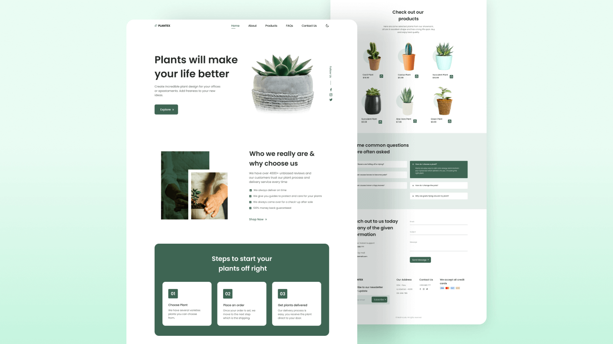
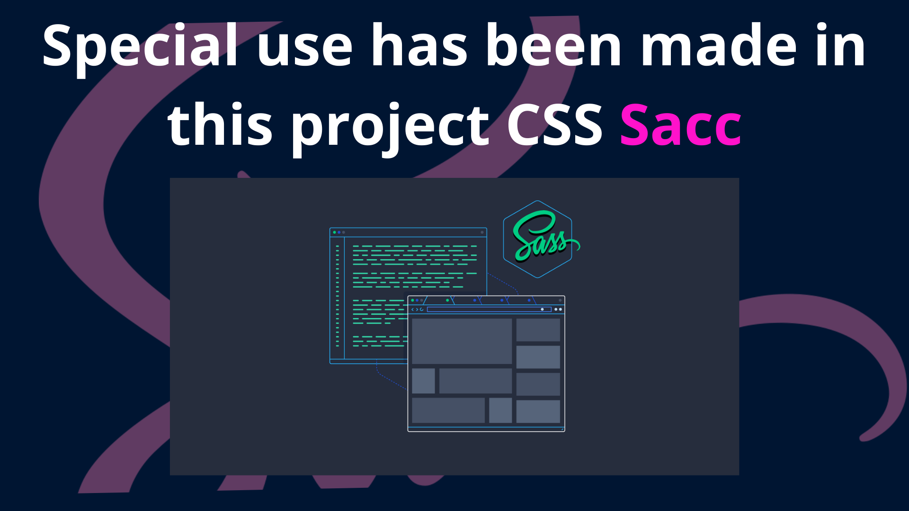
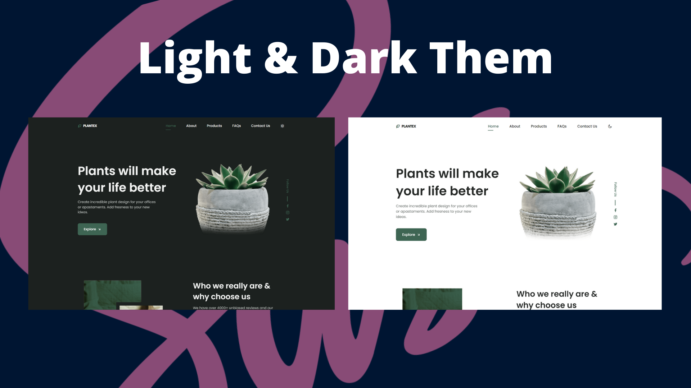
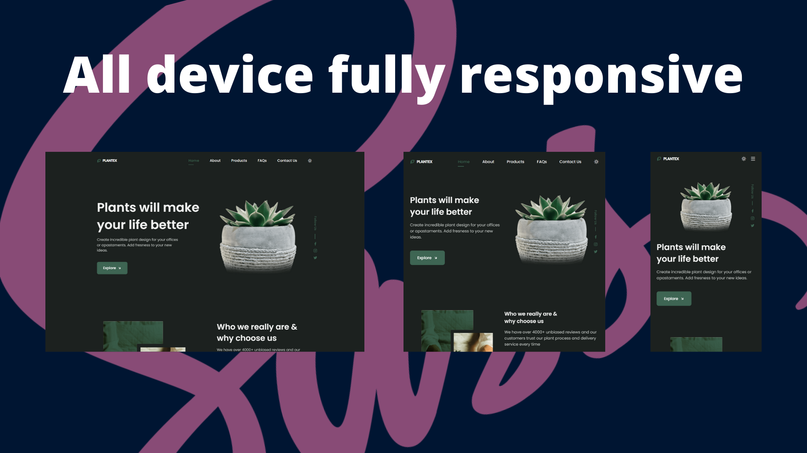

<h1 style='font-size: 35px' align="center">It is still, under construction. Now!</h1>

 
 

<h1 style='font-size: 20px' >Used here:</h1>

1. Html
2. Sass
3. JavaScript
4. Remix Icon
5. Google font
6. Scroll Reveal
 
<!-- Important documentation -->
<h1 style='font-size: 25px' align="center">Some important documentation of this project.</h1>

<h3>This is a fancy tree selling website. See the Payment Gateway section here.
A total of ten sections have been placed here.Especially in the product sales section. This website will be very minimalist and very nice. 
Particular emphasis has been placed here on the theme. There are two types of themes: light and dark. 
This will display nicely on all devices.
</h3>
 

<!-- Project clone link  -->
Clone this project hear: `https://github.com/coder-rakibul/Plant-site.git`

 
<!-- Live prevew link -->

# [🔴Live prevew this project.](https://coder-rakibul.github.io/Plant-site/)

<!-- Images -->
 

  

  

  

  

  

<h1 style='font-size: 30px' align="center">God Almighty, He has kept me alive, He gives me sustenance.</h1>
